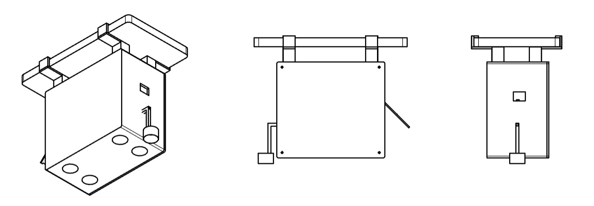
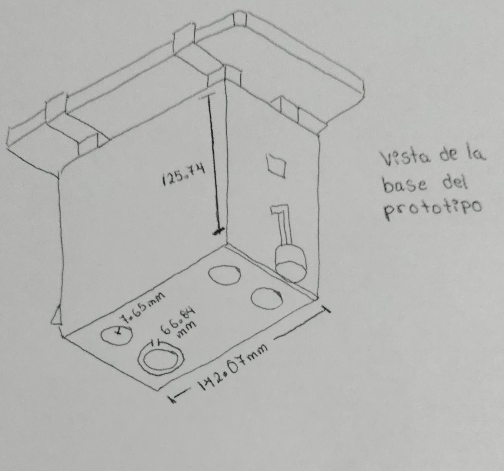
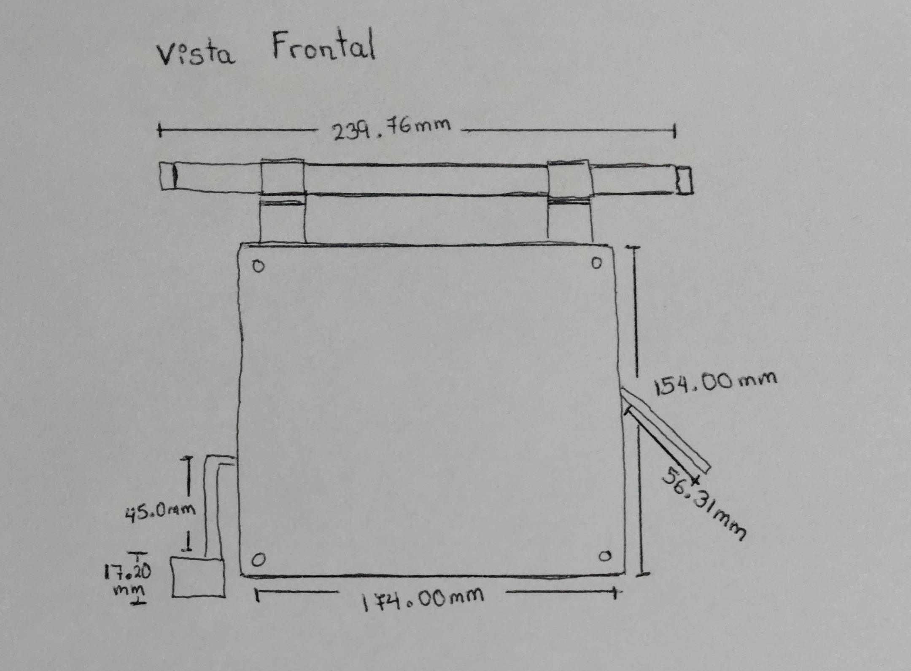
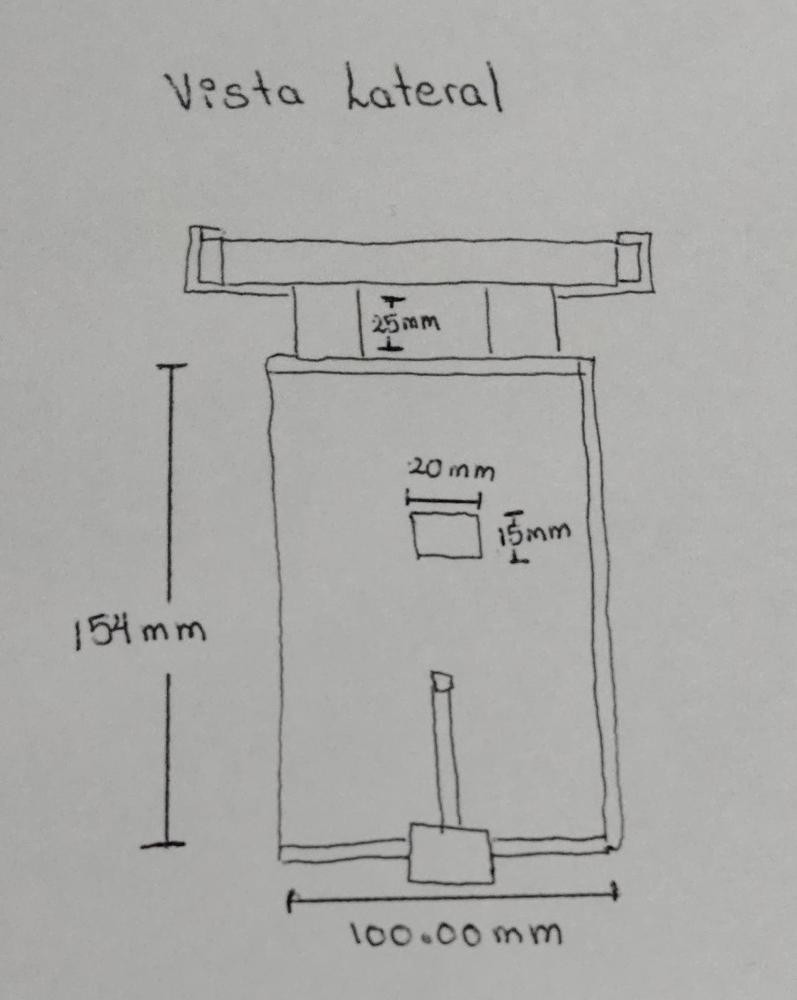
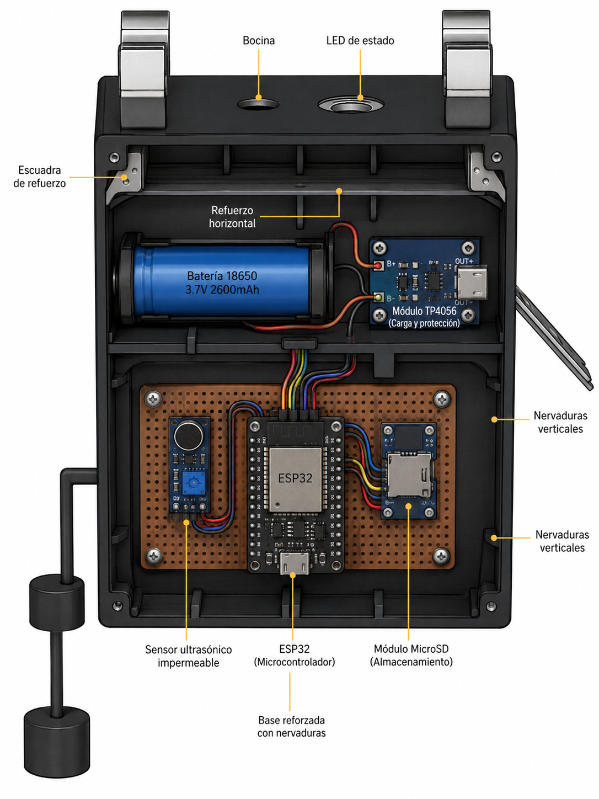

# Bocetos Actualizados - Llaqta Guardian

A continuación se presentan los bocetos definitivos del contenedor del dispositivo, detallando la distribución externa y la disposición del espacio interno para el hardware.

---

## Vista General del Contenedor

### 1. Conjunto de Vistas Externas

**Descripción:** Representación general del diseño mecánico del contenedor. Se muestran de manera conjunta las vistas isométrica, frontal y lateral utilizadas para validar la geometría, dimensiones y distribución de los elementos externos del sistema.

---

## Vistas Externas Detalladas

### 2. Vista Isométrica / Perspectiva

**Descripción:** Vista general en tres dimensiones que muestra la geometría del contenedor, la disposición de la tapa y las zonas de salida de sensores.

### 3. Vista Frontal (Elevación)

**Descripción:** Proyección frontal que detalla el acceso principal, interfaces visibles (como LEDs de estado o interruptores externos) y dimensiones principales de la fachada.

### 4. Vista Lateral / Perfil

**Descripción:** Muestra el grosor del contenedor, la distribución vertical de los componentes y los puntos de sujeción para la instalación en campo.

---

## Vista Interior a Color

### 5. Distribución Interna de Componentes

**Descripción:** Vista detallada a color que muestra la organización del espacio interior del dispositivo. Se observa la ubicación de la placa perforada donde se monta el ESP32, el sistema de gestión de energía compuesto por la batería 18650 y el módulo TP4056, el recorrido del cableado de la arquitectura de hardware, así como los elementos estructurales de refuerzo (nervaduras y escuadras) que proporcionan rigidez mecánica al contenedor. También se identifican la bocina, el LED de estado y las conexiones hacia los sensores externos.

