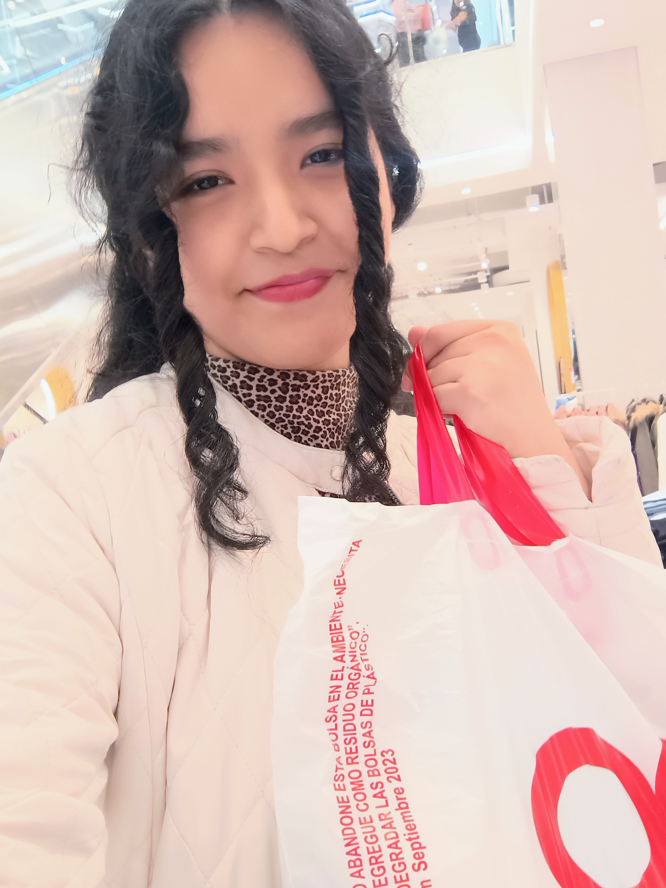
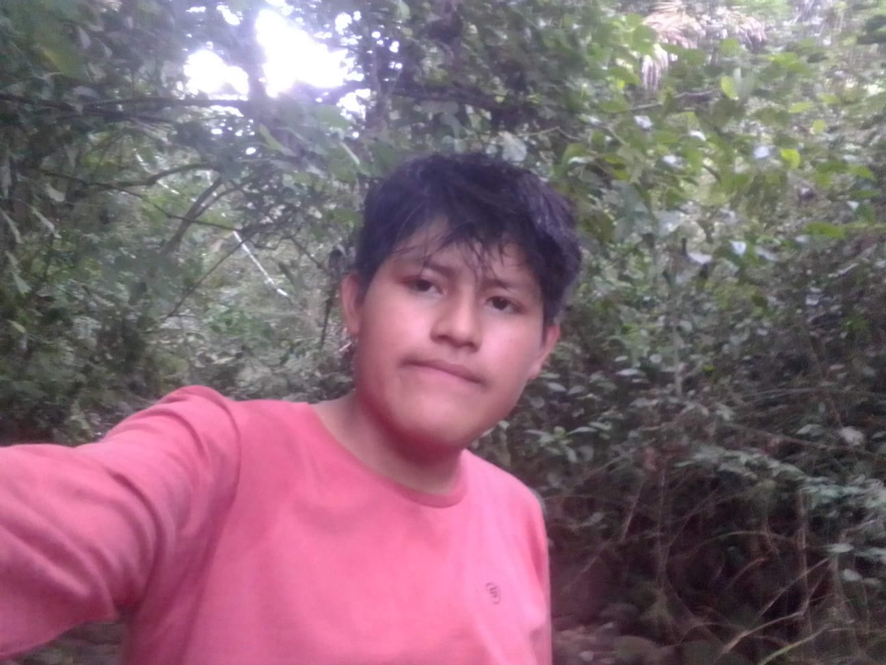

# 🌍 Equipo 14 - Fundamentos de diseño
## Carrera de Ingeniería Ambiental / Informática/ Industrial
## Universidad Peruana Cayetano Heredia
## 👥Descripción del equipo

### Somos el **equipo 14** del curso de **Fundamentos de Diseño 2026-1**, conformado por estudiantes de distintas ramas de ingeniería.

### *Nuestro objetivo es aplicar la metodología de diseño para generar soluciones innovadoras, reales y con impacto social, tecnológico y ambiental.*
## 🎯 Objetivos de Desarrollo Sostenible (ODS)

*Nuestro proyecto se alinea con los siguientes ODS:*

- 💧 **ODS 6:** Agua limpia y saneamiento  
- 🏙️ **ODS 11:** Ciudades y comunidades sostenibles  
- 🌱 **ODS 13:** Acción por el clima

## 🌊 ODS 6: Agua limpia y saneamiento    

El **Objetivo de Desarrollo Sostenible 6** plantea la necesidad de garantizar el acceso universal a agua potable y servicios de saneamiento adecuados.

En el Perú, aproximadamente el 90% de la población urbana accede a agua potable, pero en zonas rurales amazónicas esta cifra puede descender a menos del 70%, evidenciando brechas significativas1 . 

En la selva peruana, las inundaciones contaminan fuentes de agua con residuos, sedimentos y agentes patógenos, incrementando enfermedades como diarreas, dengue entre otras. En regiones como Loreto, donde las inundaciones afectan cada año a miles de familias, el impacto sobre el acceso a agua segura es directo. Esta situación nos demuestra que la gestión del agua no puede desligarse de la gestión del riesgo de desastres, ya que eventos extremos deterioran rápidamente las condiciones sanitarias.

## 🏙️ ODS 11: Ciudades y comunidades sostenibles

El **Objetivo de Desarrollo Sostenible 11** plantea reducir significativamente el impacto de desastres en comunidades vulnerables. 

En el Perú, las lluvias intensas e inundaciones representan más del 60% de las emergencias registradas anualmente, afectando a más de 170,000 personas en la temporada del 2022 al 20232 . En la región Loreto, provincias como Requena presentan alta vulnerabilidad debido a su ubicación en zonas inundables y su limitada conectividad. De hecho, eventos recientes han llevado a declarar estado de emergencia en distritos de Requena por inundaciones recurrentes que afectan viviendas, cultivos y servicios básicos3 . 

Esta problemática nos muestra que la planificación por parte de la comunidad es clave para reducir riesgos. A su vez, la protección de infraestructuras de agua depende de una adecuada organización del territorio, lo que muestra la dependencia recíproca entre ambos objetivos.

## 🌱 ODS 13: Acción por el clima

El **Objetivo de Desarrollo Sostenible 13** se enfoca en fortalecer la resiliencia frente al cambio climático, el cual ha incrementado la frecuencia de lluvias intensas y crecidas de ríos en el Perú4 . Este fenómeno agrava tanto la disponibilidad de agua segura como la sostenibilidad de las comunidades. En este contexto, la implementación de sistemas de alerta temprana resulta clave como medida de adaptación. Estos sistemas permiten anticipar inundaciones, facilitando la protección de fuentes de agua, la evacuación oportuna y la reducción de pérdidas humanas y materiales.

Por ejemplo, un sistema de alerta temprana como Llaqta Guardian podría reducir la exposición al riesgo al emitir alertas oportunas incluso en contextos de baja conectividad. De esta manera, la integración de estos tres objetivos resulta fundamental para abordar la problemática de las inundaciones en la Amazonía peruana.

## 📸 Fotografía del Equipo

  
   
  <em>Figura 1. Fotografía del equipo 14</em>

## 👥 Integrantes del equipo

| Foto | Nombre | Rol | Habilidades |
|------|--------|-----|------------|
|  | Doménica Pérez | Líder de equipo | Gestión de proyectos con enfoque en innovación social, sostenibilidad e impacto ambiental |
|  | Sofía Calva | Programadora | Programación, simulación y automatización de procesos |
|  | Némesis Dulanto | Diseñadora | Diseño de prototipos, innovación, creatividad y adaptabilidad  |
|  | Kevin Huillca | Investigación | Investigación de problemáticas urbanas, análisis de datos y propuestas de desarrollo comunitario sostenible |
|  | Caleb Cayco | Documentación | Elaboración de informes, redacción técnica y presentación de resultados |

## 📌 Resumen 

### Este repositorio presenta quiénes somos como equipo, nuestras motivaciones y los ODS en los que enfocaremos nuestro proyecto durante el curso. Buscamos desarrollar soluciones que integren tecnología, diseño e impacto social 🌍✨

### 📚 Referencias 

1. Ministerio de Vivienda, Construcción y Saneamiento (MVCS). *Acceso a agua y saneamiento en el Perú. Lima: MVCS; 2022.* Disponible en: https://www.gob.pe/vivienda

2. Instituto Nacional de Defensa Civil (INDECI). *Reporte de emergencias por lluvias intensas 2022–2023. Lima: INDECI; 2023.* Disponible en: https://sinpad.indeci.gob.pe/sinpad/

3. Gobierno del Perú. *Declaratorias de estado de emergencia por inundaciones en Loreto. Lima: PCM; 2023.* Disponible en: https://www.gob.pe/pcm

4. *Ministerio del Ambiente del Perú (MINAM). Estrategia nacional ante el cambio climático. Lima: MINAM; 2021.* Disponible en: https://www.gob.pe/minam

